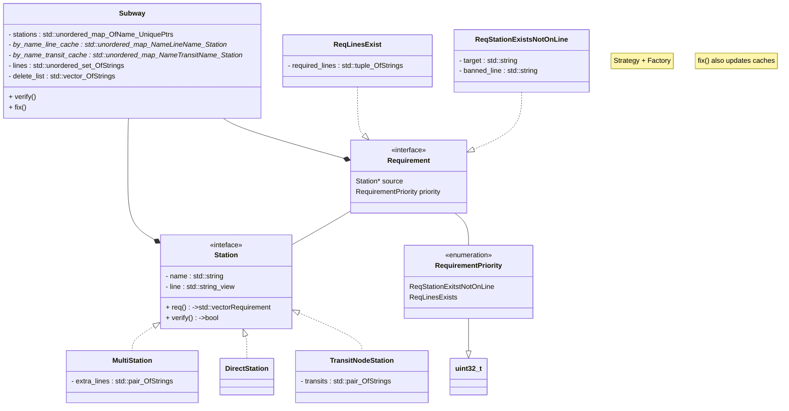

```mermaid
classDiagram
    note "Strategy + Factory"

    class Station {
      <<inteface>>
      - name : std::string
      - line : std::string_view

      + req()->std::vectorRequirement
      + verify()->bool
    }
    class MultiStation {
      - extra_lines : std::pair_OfStrings
    }
    class TransitNodeStation {
      - transits : std::pair_OfStrings
    }

    class Requirement {
      <<interface>>
    }
    class ReqLinesExist {
      - required_lines : std::tuple_OfStrings
    }
    class ReqStationExistsNotOnLine {
      - target : std::string
      - banned_line : std::string
    }

    Station <|.. MultiStation
    Station <|.. DirectStation
    Station <|.. TransitNodeStation

    Requirement -- Station

    ReqStationExistsNotOnLine ..|> Requirement
    ReqLinesExist ..|> Requirement

    RequirementPriority --|>uint32_t

    class RequirementPriority {
      <<enumeration>>
      ReqStationExitstNotOnLine
      ReqLinesExists
    }

    class Requirement {
      Station* source
      RequirementPriority priority
    }

    Subway --* Station
    Subway --* Requirement

    Requirement -- RequirementPriority
    
    class Subway {
      - stations : std::unordered_map_OfName_UniquePtrs
      - by_name_line_cache : std::unordered_map_NameLineName_Station*
      - by_name_transit_cache : std::unordered_map_NameTransitName_Station*

      - lines : std::unordered_set_OfStrings
      
      - delete_list : std::vector_OfStrings

      + verify()
      + fix()
    }
  note "fix() also updates caches"
    
```
