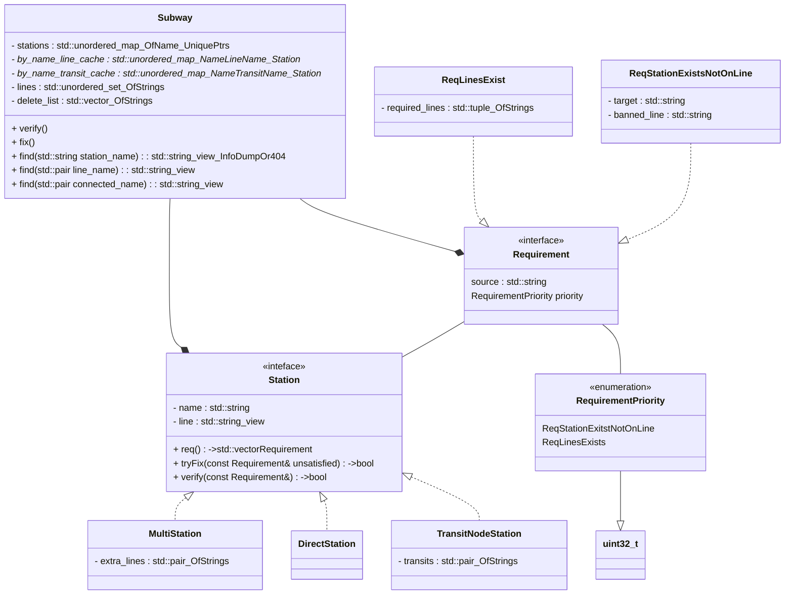

# Lab 3: Class hierarchies. Subway.
:battery:
## Design choices

* It is presumed that transit node stations can connect to any other kind of station as long as that station is on a different line from the transit node station and every other station that's connected to the transitional node station. This assumption simplifies both the validation and the search algorithms. This presumption is derived from the assignment ("для пересадочного узла... названия станций ... перехода" - "поиск по станции-переходу", т.е. пересадочные узлы имеют станции-переходы - обычные станции, обратное не заявлено)

* Transition nodes are allowed to have different connected stations on the same line. This is seen as a quirk not an error (because there's nothing inherintly erroneous that would break the programm's logic about it). And because actually checking if they are or not would require adding an extra requirement type, but why fix it, if it ain't broken

* All error checking is done after an action through the hierarchy of requirements. This avoids having two ways of error checking instead of one, some actions don't wait for the system-wide check and append requirements directly into the list as an optimization for operations with well known effects (e.g. adding a station, the only object that can become invalid as a result of this operation is the newly added station)

* Lines are non-owning descriptors, this is a zero-cost abstraction, owning lines would make the design substantially more complex with literally no benefits to performance nor extendability whatsoever. Furthermore owning lines imply more than station-name+line-name connection descriptors, because now we have more meaningful and rubust identity than just a name string, which, in turn, demands immediate validity, which is the opposite of the assignment (and also is Sl-o-w and very complicated)

* Model is broken down into two parts: search and validation, view and viewmodel will mostly be taken from lab 2 and supplemented with respective UML class diagrams (both are SOLID and are organized in the OOP paradigms with use of patterns)

* Validation is done in two steps: (i) iteration along the table (vector for the locality optimization) of stations (references resources as unique_ptr) and returning list of requirements posed onto the subway (other stations and lines) by each station, and (ii) checking requirements by the order of priority (enum class in case I need to add other priorities) and putting together delete list

* Requirements within the same priority are assumed to be independent of each other and of requirements of lower priorities, hence any deletions do not invalidate requirements that have already been fulfilled

* First two stages of verification can be done in parallel through some kind of scheduler using a simple round-robin, by further shared-mutex locking the list of requirements and the delete list respectively for each stage. The third stage of actually deleting the station resources will be done in the serial fashion.

* Search stage: caching - the name of the game. The assignment requires different kinds of search. Each kind will keep a cache i.e. a hash-map of a respective kind of key to a ptr to the station that satisfies that key. Caches will be updated after the deletion stage.

* Serial complexity: validation - O(n) (inescapable), all other operations - O(1)

* Presenting will use a resumable coroutine for looser coupling (initial algo also required it is resumable, but I can't remeber why, unfortunately)

:wrench:
## UML class diagram for the model

