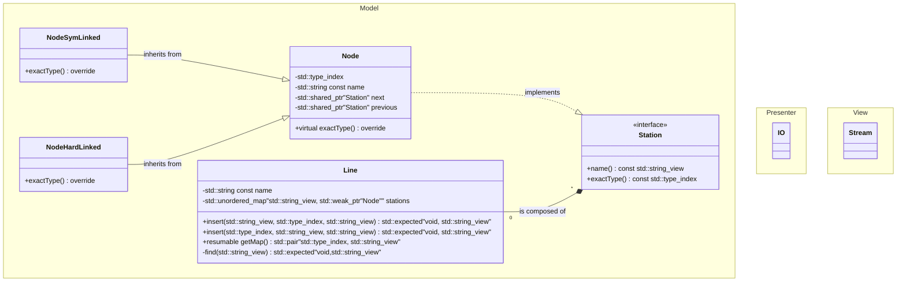

# Lab 3: Class hierarchies
## :sparkles: Architecture overview
This application uses common in mobile Java development MVP pattern.  
The app supports both CLI, as well as GUI.
## :battery: UML
### Diagram

### Commentary
Hardlinked and SymLinked nodes shall only be linked to other nodes of the same type
(as a node can only be linked in one way at a time).

## :wrench: Class descriptons
### Model::Line
#### **_std::unordered_map<std::string, Station&gt;_** 
Unoredered map for fast access to any liked list element through weak\_ptr. 
We can then use ranges library with transform and monadic conditional operators to
delete disconnected stations in linear time.  
Adding and deleting nodes happens in constant time, the class correctness of the polymorphic 
tree nodes, however, is only guaranteed after running the check function in linear time untill
the next delete run.

Adding stations, deleting stations, and
finding stations all take constant time in any sensible implementation.
#### getMap()
A coroutine that provides the presenter with data at the viewer is printing it.
### Model::Station
An undirected tree node. Changing the node type should delete this node, and create a new one 
of the new type in the old node's place. The any node in another tree linked to the old node is 
left in a broken state in case of such operation, and needs to be reevaluated on the next 
check\_tree run.
#### Node
This should leave a virtual function for type that is to be overriden by the interiting classes.
#### NodeSymLinked
Inherits from the Node class. Contains weak\_ptr to the connected node on another Line.
#### NodeHardLinked
Inherits from the Node class. If this gets deleted in one line, the other line should 
replace the deleted hardLinked node with a node of the same name. This is awkward, and 
creates a bit of a misnomer as a hardLinked node stays valid, even if the node it's hardlinked
to gets deleted. On the other hand, it is hardliked in the sense that changing one node (i.e. its name)
should change the name of the other node (should have name field pointing to the same resource).  

Like the symbolically linked node, also contains a weak\_ptr to a station on another line. The only practical 
difference is that this will have a separate name resource.
